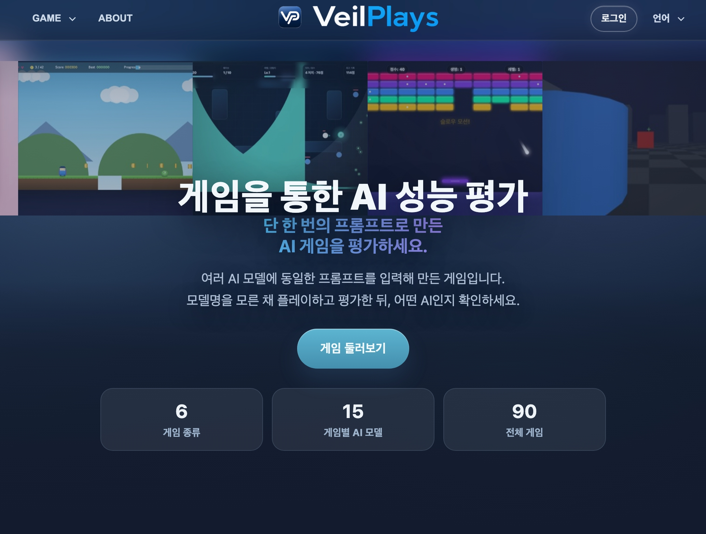
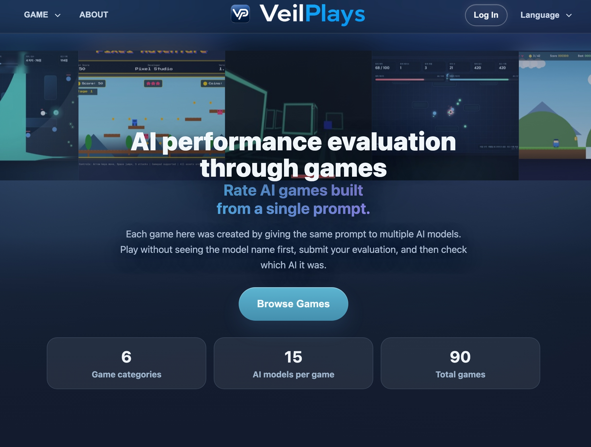
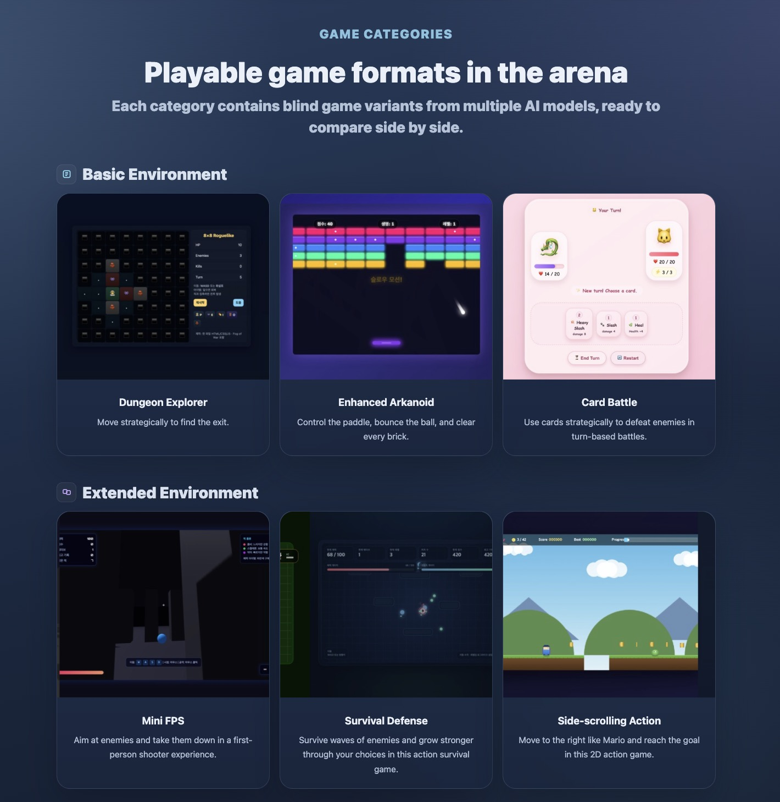
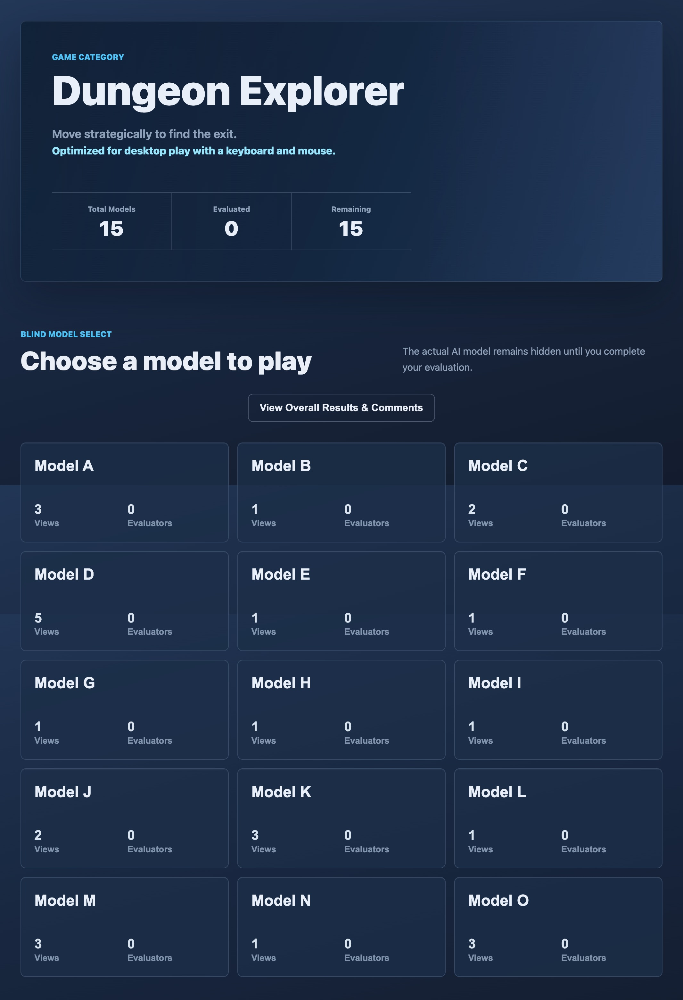
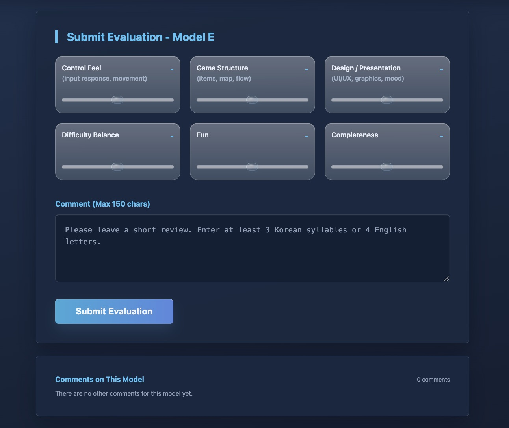
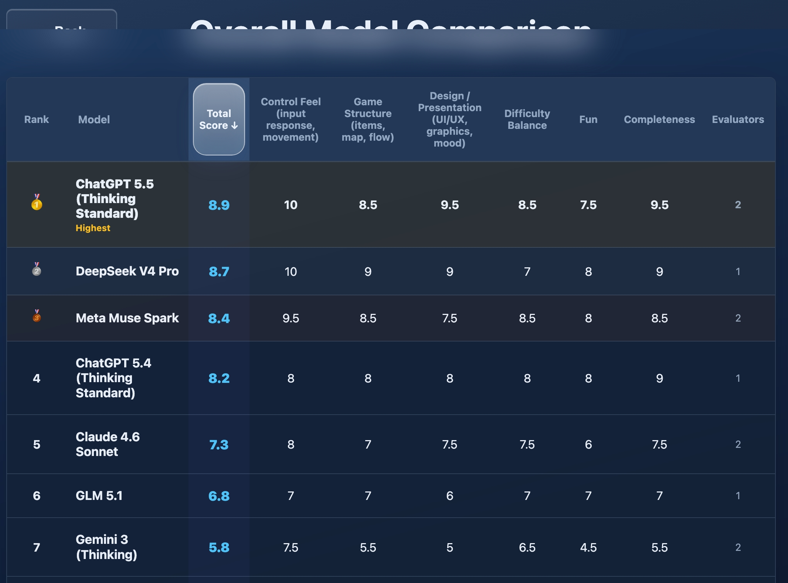
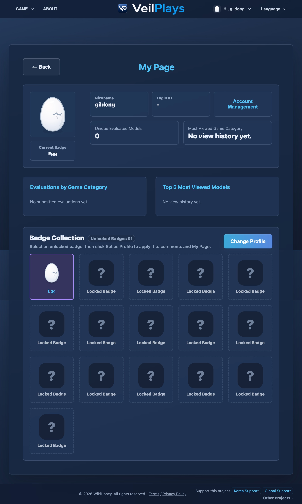

# VeilPlays


**VeilPlays**는 동일한 프롬프트로 여러 AI 모델이 제작한 게임을 직접 플레이하고, 블라인드 방식으로 비교 평가하는 **게임 기반 AI 모델 성능 비교·벤치마크 서비스**입니다.

- Service: [https://www.veilplays.com](https://www.veilplays.com)
- API health check: [https://api.veilplays.com/healthz](https://api.veilplays.com/healthz)

## Overview

사용자는 모델명을 모른 채 게임을 플레이하고, 조작감·게임 구성·디자인·난이도·재미·완성도 기준으로 평가를 남깁니다. 평가를 제출한 뒤에는 해당 게임을 만든 AI 모델명을 확인할 수 있고, 장르별 전체 모델 비교 결과와 코멘트를 볼 수 있습니다.

현재 구성은 6개 게임 장르, 장르별 15개 AI 모델, 총 90개 블라인드 게임입니다.





## Main Features

- **Blind AI game evaluation**: 실제 모델명은 평가 전까지 숨기고, Model A-O로만 노출합니다.
- **Six playable game formats**: 던전 탐색, 강화된 벽돌깨기, 카드배틀, 미니 FPS, 서바이벌 디펜스, 횡스크롤 액션을 제공합니다.
- **Structured scoring**: 조작감, 게임 구성, 디자인/연출, 난이도 균형, 재미, 완성도 6개 항목을 평가합니다.
- **Comments and reactions**: 평가 코멘트, 댓글, 좋아요/싫어요, 관리자 숨김 처리를 지원합니다.
- **Model comparison rankings**: 장르별 전체 모델 성능을 표로 비교하고 상위 모델을 확인합니다.
- **Evaluation gate for top results**: 상위 모델명은 1회 이상 평가를 남긴 사용자에게 공개합니다.
- **Account and badge system**: 마이페이지에서 평가 기록, 조회 기록, 획득 배지, 프로필 배지를 관리합니다.
- **Multilingual UI**: 한국어와 영어 UI를 지원합니다.
- **OAuth and email account flow**: 이메일 로그인과 Google, Kakao, Naver, GitHub, Discord, Steam 연동 흐름을 지원합니다.
- **Admin moderation**: 관리자 계정에서 사용자, 코멘트, 댓글을 제재하거나 숨김 처리할 수 있습니다.

## Screens

### Game Categories

랜딩 페이지에서 게임 장르를 바로 확인하고, 각 장르 카드에서 모델 선택 화면으로 이동합니다.



### Blind Model Select

게임별 15개 모델은 Model A-O로 표시됩니다. 실제 AI 모델명은 평가 완료 전까지 노출하지 않습니다.



### Evaluation

평가 항목은 사용자가 직접 슬라이더를 조작해야 제출할 수 있습니다. 모든 항목을 평가하고 코멘트 조건을 충족해야 제출됩니다.



### Model Comparison

전체 모델 비교 페이지에서는 총점과 항목별 평균 점수, 평가자 수, 코멘트를 함께 확인할 수 있습니다.



### My Page

마이페이지에서는 평가 통계, 조회 기록, 배지 수집 현황, 프로필 배지 변경을 제공합니다.



## Tech Stack

| Area | Stack |
| --- | --- |
| Frontend | HTML, CSS, Vanilla JavaScript |
| Backend | Python, FastAPI |
| Database | Supabase PostgreSQL |
| Authentication | Firebase Authentication, Firebase Admin SDK |
| OAuth providers | Google, Kakao, Naver, GitHub, Discord, Steam |
| Email | Brevo |
| Hosting | Vercel for static frontend, Render for FastAPI API |
| Security edge | Cloudflare DNS, SSL, cache rules, rate limiting rules |
| Analytics and search | Google Analytics, Google Search Console, Naver Search Advisor |

## Architecture

```text
User Browser
    |
    v
Cloudflare
    |
    +--> Vercel Static Frontend
    |       - HTML/CSS/JS
    |       - SEO pages, sitemap, robots.txt
    |       - runtime-config.js
    |
    +--> Render FastAPI Backend
            - game catalog API
            - auth/account API
            - evaluation/comment API
            - admin moderation API
            |
            +--> Supabase PostgreSQL
            +--> Firebase Auth/Admin SDK
            +--> Brevo email
            +--> OAuth provider APIs
```

## Repository Structure

```text
.
├── backend/
│   ├── main.py                 # FastAPI application
│   ├── auth.py                 # Firebase token verification
│   ├── database.py             # Supabase client helpers
│   ├── migrations/             # Supabase SQL migrations
│   ├── static/                 # frontend assets served locally and built for Vercel
│   └── requirements.txt
├── scripts/
│   ├── build-static-site.mjs    # Vercel static output builder
│   └── verify-deployment-prep.mjs
├── assets/readme/              # README screenshots
├── vercel.json
└── README.md
```

## Local Development

Backend dependencies:

```bash
python3 -m venv backend/.venv
source backend/.venv/bin/activate
pip install -r backend/requirements.txt
```

Environment:

```bash
cp backend/.env.example backend/.env
```

Fill the required Firebase, Supabase, OAuth, email, and secret values in `backend/.env`.

Run the local API and static frontend:

```bash
python3 -m uvicorn backend.main:app --reload --host 127.0.0.1 --port 8000
```

Open:

```text
http://127.0.0.1:8000
```

Build static frontend for Vercel-style deployment:

```bash
node scripts/build-static-site.mjs
```

Deployment preparation check:

```bash
node scripts/verify-deployment-prep.mjs
```

## Security Notes

- Server-side data access is handled through the FastAPI backend.
- Supabase RLS is enabled with deny-by-default policies for direct anonymous/authenticated access.
- Firebase ID tokens are verified server-side before account, evaluation, and admin actions.
- Admin APIs require configured super-admin Firebase UIDs.
- Cloudflare rate limiting is used for sensitive auth mail and recovery endpoints.
- Static frontend is served with security headers through Vercel configuration.

## Repository Rules

- `docs/`는 로컬 작업 자료 전용이다. `.gitignore`에서 제거하지 말고, `docs/` 하위 파일에 대한 예외를 만들지 말고, `docs/` 안의 어떤 파일도 GitHub에 강제로 추가하지 않는다.
- 커밋 메시지는 반드시 한국어로 작성한다.
- 바로 푸시하지 않는 작업도 셧다운 대비와 버전 관리를 위해 Git 커밋으로 기록한다.
